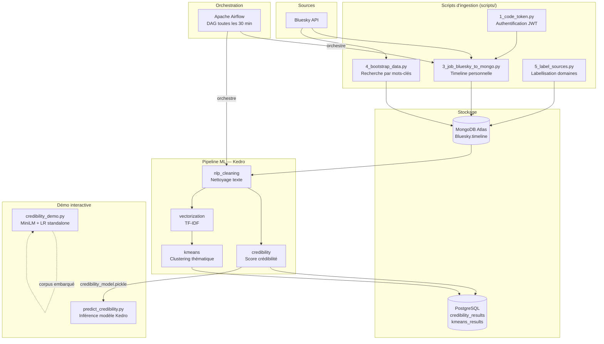
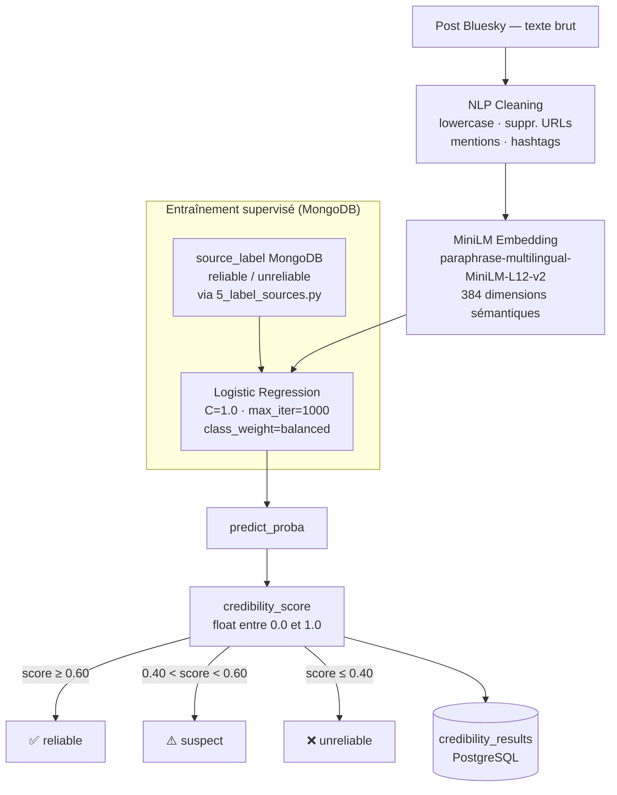
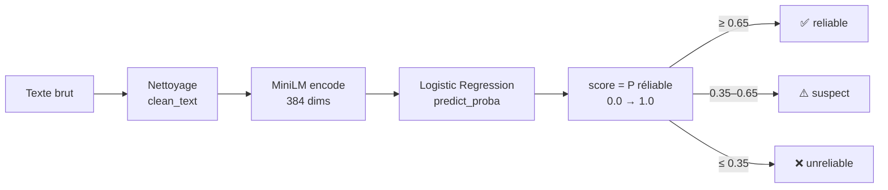
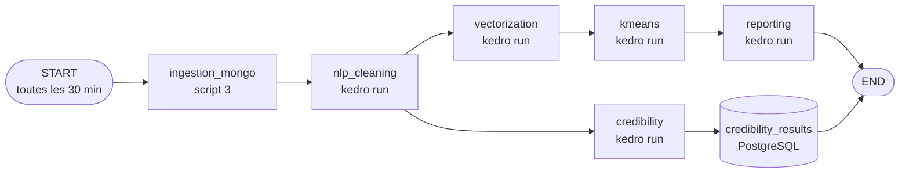
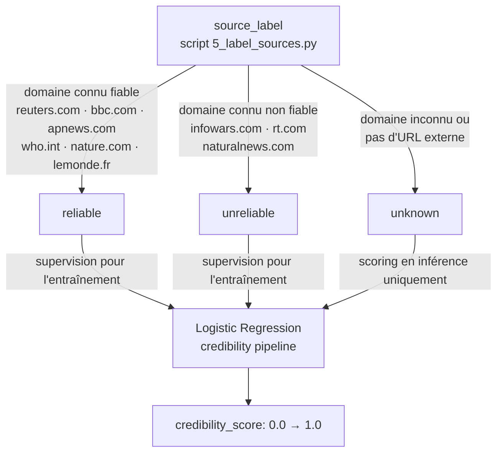
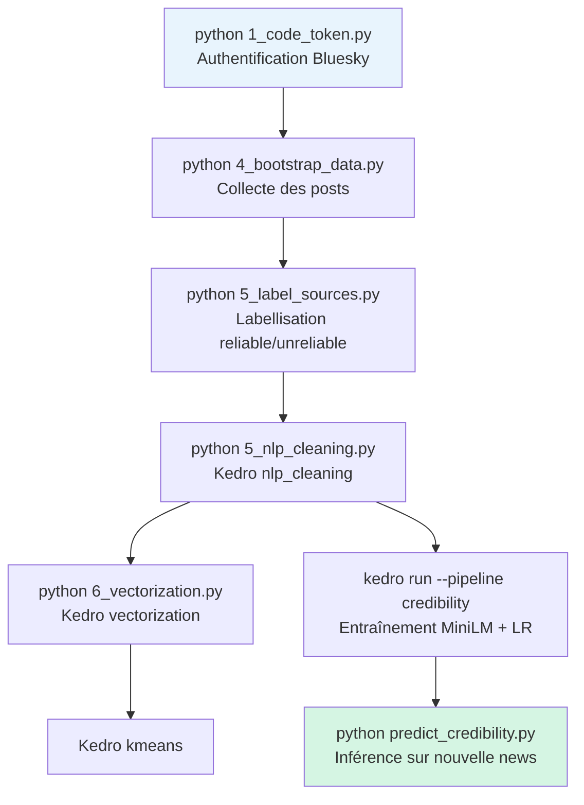

# Architecture du projet — Bluesky News Credibility

## 1. Vue d'ensemble du projet



---

## 2. Flux de données détaillé

```mermaid
flowchart LR
    subgraph INGEST ["Ingestion"]
        I1[4_bootstrap_data.py\nrecherche mots-clés]
        I2[3_job_bluesky_to_mongo.py\ntimeline personnelle]
    end

    subgraph NLP ["nlp_cleaning (Kedro)"]
        N1[fetch_from_mongo\nExtraction MongoDB]
        N2[clean_posts\nlowercase · suppr. URLs\nmentions · hashtags]
    end

    subgraph EMB ["credibility (Kedro)"]
        E1[generate_embeddings\nMiniLM-L12-v2 · 384 dim]
        E2[train_credibility_classifier\nLogistic Regression]
        E3[score_credibility\ncredibility_score 0.0→1.0]
        E4[save_credibility_to_postgres]
    end

    subgraph VEC ["vectorization (Kedro)"]
        V1[vectorize_posts\nTF-IDF · 5 000 features\nn-grammes 1-2]
    end

    subgraph KM ["kmeans (Kedro)"]
        K1[run_kmeans\n20 clusters · L2 norm]
        K2[score_reliability\ndistance centroïde]
        K3[save_to_postgres]
    end

    subgraph OUT ["Sorties"]
        O1[(credibility_results\nPostgreSQL)]
        O2[(kmeans_results\nPostgreSQL)]
    end

    I1 & I2 --> MDB[(MongoDB\nBluesky.timeline)]
    MDB --> N1 --> N2

    N2 -->|cleaned_bluesky_posts.parquet| E1
    N2 -->|cleaned_bluesky_posts.parquet| V1

    E1 -->|embedded_posts.parquet| E2
    E1 --> E3
    E2 -->|credibility_model.pickle| E3
    E3 --> E4 --> O1

    V1 -->|vectorized_posts.parquet| K1
    K1 --> K2 --> K3 --> O2
```



---

## 3. Pipeline de crédibilité Kedro (détail)



---

## 4. Méthode MiniLM + Régression Logistique — Explication

### 4.1 MiniLM — Encodage sémantique

Le modèle utilisé est **`paraphrase-multilingual-MiniLM-L12-v2`** de la librairie
`sentence-transformers`. C'est une version distillée (compressée) de BERT :

| Propriété | Valeur |
|-----------|--------|
| Architecture | Transformer (BERT distillé) |
| Couches | 12 couches d'attention |
| Langues | 50+ langues (français, anglais, …) |
| Dimension de sortie | **384 dimensions** |
| Poids | ~120 Mo |

**Principe :** chaque texte est converti en un vecteur de 384 nombres réels qui
capture son *sens sémantique*. Deux phrases similaires produisent des vecteurs
proches (cosinus ≈ 1). Ce vecteur est l'**embedding**.

```
"Reuters confirms WHO guidelines" → [0.23, -0.11, 0.87, …]  (384 valeurs)
"Les vaccins causent l'autisme"   → [-0.45, 0.62, -0.13, …] (384 valeurs)
```

### 4.2 Régression Logistique — Classification binaire

La **Logistic Regression** (scikit-learn) prend l'embedding de 384 dimensions
en entrée et produit une probabilité d'appartenance à chaque classe.

**Formule du score de crédibilité :**

```
score = P(classe = "reliable" | embedding)
      = σ(W · embedding + b)
      = 1 / (1 + exp(-(W · embedding + b)))
```

- `W` : matrice de poids (1 × 384) apprise pendant l'entraînement
- `b` : biais (intercept)
- `σ` : fonction sigmoïde qui ramène la sortie dans [0, 1]

**Entraînement :**
- Les exemples *reliable* et *unreliable* sont encodés en embeddings
- La régression logistique apprend à séparer les deux classes dans l'espace à 384 dimensions
- `class_weight='balanced'` compense le déséquilibre si les classes sont inégales

**Inférence (prédiction sur un nouveau texte) :**



### 4.3 Pourquoi deux scripts de prédiction ?

| Script | Modèle | Données d'entraînement | Quand l'utiliser |
|--------|--------|------------------------|-----------------|
| `predict_credibility.py` | pickle Kedro | Posts MongoDB (labels domaines) | Après `kedro run --pipeline credibility` |
| `credibility_demo.py` | entraîné au démarrage | Corpus calibré embarqué (40 exemples) | Démo rapide, sans dépendance MongoDB |

Le modèle Kedro peut être biaisé si les posts MongoDB sont majoritairement
issus de sources fiables (peu d'exemples "unreliable" pour l'entraînement).
`credibility_demo.py` résout ce problème avec un corpus d'entraînement équilibré.

---

## 5. DAG Airflow — Orchestration



---

## 6. Structure des fichiers du projet

```
Projet-d-etude-SUPDEVINCI-2025-2026/
│
├── scripts/                          ← Scripts d'ingestion et d'inférence
│   ├── 1_code_token.py               Authentification Bluesky → token.json
│   ├── 2_Mongodb_Connection.py       Test de connexion MongoDB Atlas
│   ├── 3_job_bluesky_to_mongo.py     Ingestion timeline → MongoDB
│   ├── 4_bootstrap_data.py           Collecte massive par mots-clés
│   ├── 5_label_sources.py            Labellisation domaines (reliable/unreliable)
│   ├── 5_nlp_cleaning.py             Lance kedro run --pipeline nlp_cleaning
│   ├── 6_vectorization.py            Lance kedro run --pipeline vectorization
│   ├── 7_reporting.py                Lance kedro run --pipeline reporting
│   ├── bluesky_api.py                Client API Bluesky (getTimeline)
│   ├── mongo_service.py              Service MongoDB (upsert bulk)
│   ├── predict_credibility.py        Inférence sur modèle Kedro entraîné
│   └── credibility_demo.py           ★ Démo MiniLM + LR (corpus embarqué)
│
├── pipeline-kedro/                   ← Pipeline ML principal (Kedro 1.0)
│   ├── conf/base/
│   │   ├── catalog.yml               Datasets Kedro (parquet, pickle, postgres)
│   │   ├── parameters_credibility.yml  model_name, C, max_iter, threshold
│   │   ├── parameters_kmeans.yml       n_clusters, random_state
│   │   ├── parameters_nlp_cleaning.yml  filtres de nettoyage
│   │   └── parameters_vectorization.yml  max_features, ngram_range
│   ├── data/
│   │   ├── 02_intermediate/  cleaned_bluesky_posts.parquet
│   │   ├── 04_feature/       embedded_posts.parquet, vectorized_posts.parquet
│   │   ├── 05_model_input/   kmeans_results.parquet
│   │   └── 06_models/        credibility_model.pickle (versionné)
│   └── src/pipeline_kedro/pipelines/
│       ├── nlp_cleaning/     fetch_from_mongo · clean_posts
│       ├── credibility/      generate_embeddings · train · score · save_postgres
│       ├── vectorization/    TF-IDF 5 000 features
│       ├── kmeans/           K-Means 20 clusters · score_reliability
│       └── reporting/        statistiques MongoDB
│
├── airflow/dags/
│   └── bluesky_sync_dag.py           DAG toutes les 30 min
│
├── docker-compose.yml                PostgreSQL · Airflow · services
├── monitoring/prometheus.yml         Métriques Prometheus
├── docs/                             Cahier des charges · explications
├── structure/architecture.md         ← Ce fichier
└── .env                              MONGO_URI · BSKY_IDENTIFIER · BSKY_PASSWORD
```

---

## 7. Labels de crédibilité — règle de décision



---

## 8. Ordre d'exécution complet



**Raccourci démo (sans MongoDB) :**
```bash
python scripts/credibility_demo.py
```
