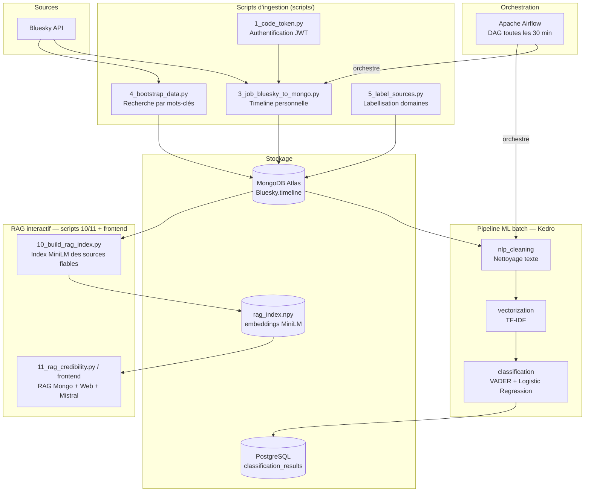
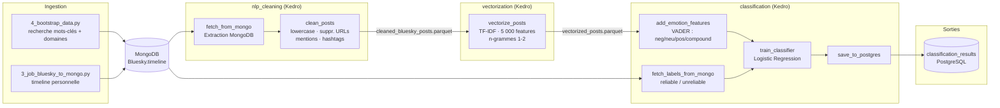
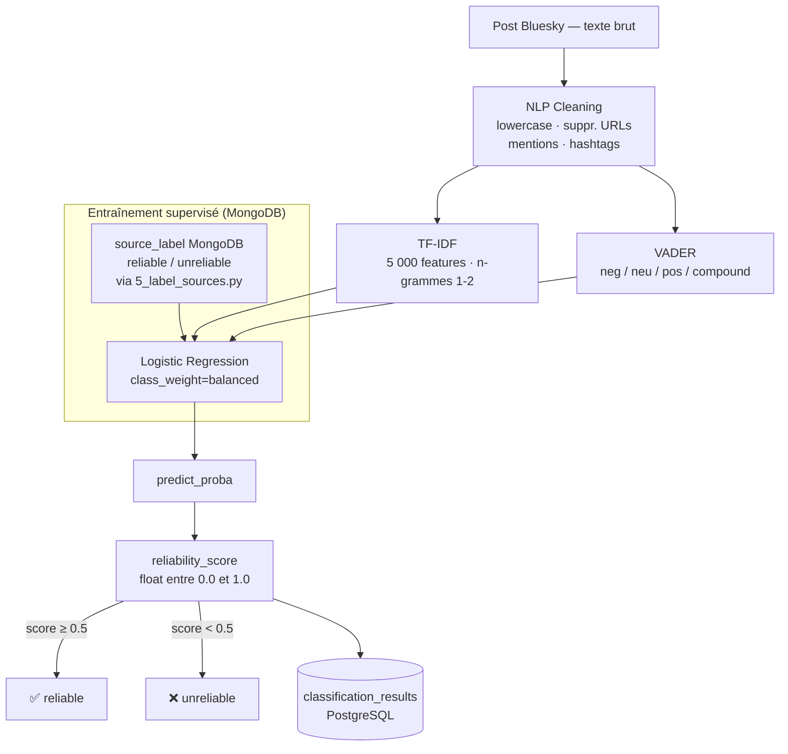
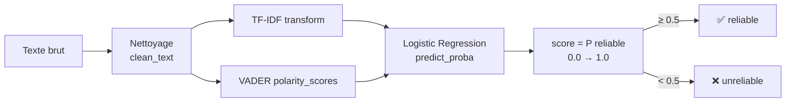
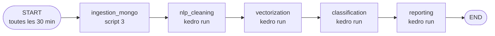
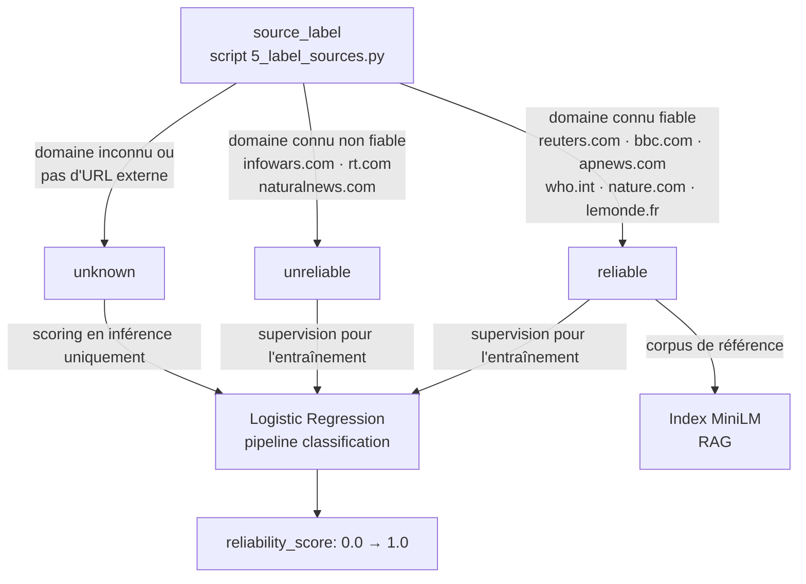
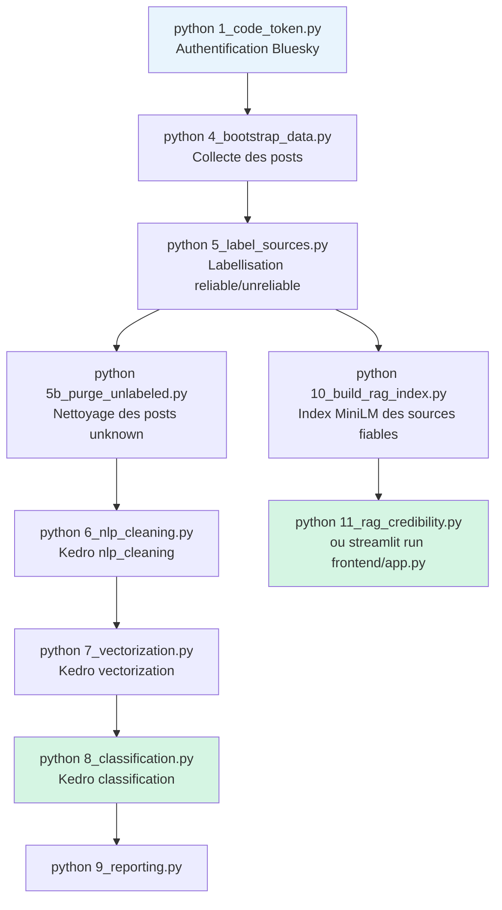

# Architecture du projet — Bluesky News Credibility

## 1. Vue d'ensemble du projet



---

## 2. Flux de données détaillé



---

## 3. Pipeline de classification Kedro (détail)



---

## 4. Méthode TF-IDF + VADER + Régression Logistique — Explication

### 4.1 TF-IDF — Représentation lexicale

Chaque post nettoyé est transformé en vecteur creux de fréquences de mots/bigrammes
pondérées (5 000 features max, `sklearn.feature_extraction.text.TfidfVectorizer`).

### 4.2 VADER — Intensité émotionnelle

`vaderSentiment` donne 4 scores par texte (`neg`, `neu`, `pos`, `compound`).
Hypothèse : les fake news ont souvent un registre plus chargé émotionnellement
(indignation, alarmisme) que la presse fiable — ces 4 scores sont concaténés
aux features TF-IDF.

### 4.3 Régression Logistique — Classification binaire

La **Logistic Regression** (scikit-learn, `class_weight="balanced"` pour compenser
le déséquilibre reliable/unreliable) prend le vecteur TF-IDF + émotion en entrée et
produit une probabilité d'appartenance à la classe "reliable".

```
score = P(classe = "reliable" | features)
      = σ(W · features + b)
```

**Inférence (prédiction sur un nouveau texte)** — voir `scripts/test_single_news.py` :



---

## 5. RAG — Fact-checker interactif (frontend)

Système **indépendant** du pipeline Kedro ci-dessus, utilisé par `frontend/app.py` :

1. `10_build_rag_index.py` encode tous les posts MongoDB `reliable` avec MiniLM
   (`paraphrase-multilingual-MiniLM-L12-v2`, 384 dims) et sauvegarde l'index dans
   `pipeline-kedro/data/06_models/rag_index.npy`.
2. `rag_service.py` (`RAGCredibilityService`) charge cet index, retrouve les
   articles les plus proches sémantiquement d'une news donnée (similarité cosinus),
   complète avec une recherche web (DuckDuckGo / Wikipédia) sur des domaines fiables,
   puis envoie les deux contextes à **Mistral** pour obtenir un score de
   crédibilité (0-100) + justification + alignement (confirmé/contredit/non couvert).
3. `11_rag_credibility.py` : interface CLI. `frontend/app.py` : interface Streamlit.

---

## 6. DAG Airflow — Orchestration



---

## 7. Structure des fichiers du projet

```
Projet-d-etude-SUPDEVINCI-2025-2026/
│
├── scripts/                          ← Scripts d'ingestion, ML et RAG
│   ├── 1_code_token.py               Authentification Bluesky → token.json
│   ├── 2_Mongodb_Connection.py       Test de connexion MongoDB Atlas
│   ├── 3_job_bluesky_to_mongo.py     Ingestion timeline → MongoDB
│   ├── 4_bootstrap_data.py           Collecte massive par mots-clés/domaines
│   ├── 5_label_sources.py            Labellisation domaines (reliable/unreliable)
│   ├── 5b_purge_unlabeled.py         Supprime les posts "unknown" de MongoDB
│   ├── 6_nlp_cleaning.py             Lance kedro run --pipeline nlp_cleaning
│   ├── 7_vectorization.py            Lance kedro run --pipeline vectorization
│   ├── 8_classification.py           Lance kedro run --pipeline classification
│   ├── 9_reporting.py                Lance kedro run --pipeline reporting
│   ├── 10_build_rag_index.py         Construit l'index MiniLM (RAG)
│   ├── 11_rag_credibility.py         CLI : score de crédibilité RAG + Mistral
│   ├── bluesky_api.py                Client API Bluesky (timeline + recherche)
│   ├── mongo_service.py              Service MongoDB (upsert bulk)
│   ├── rag_service.py                RAGCredibilityService (Mongo + Web + Mistral)
│   ├── web_search_service.py         Recherche web (DuckDuckGo/Wikipédia)
│   ├── test_news.py / test_single_news.py  Inférence locale du modèle classification
│
├── frontend/
│   └── app.py                        Interface Streamlit du fact-checker (RAG)
│
├── pipeline-kedro/                   ← Pipeline ML batch (Kedro 1.0)
│   ├── conf/base/
│   │   ├── catalog.yml               Datasets Kedro (parquet, pickle, postgres)
│   │   ├── parameters_classification.yml  test_size, class_weight
│   │   ├── parameters_nlp_cleaning.yml    filtres de nettoyage
│   │   └── parameters_vectorization.yml   max_features, ngram_range
│   ├── data/
│   │   ├── 02_intermediate/  cleaned_bluesky_posts.parquet
│   │   ├── 04_feature/       vectorized_posts.parquet, posts_with_emotion.parquet
│   │   └── 06_models/        classifier_model.pickle, tfidf_vectorizer.pickle,
│   │                         rag_index.npy (versionnés)
│   └── src/pipeline_kedro/pipelines/
│       ├── nlp_cleaning/     fetch_from_mongo · clean_posts
│       ├── vectorization/    TF-IDF 5 000 features
│       └── classification/   add_emotion_features · train_classifier · save_to_postgres
│
├── airflow/dags/
│   └── bluesky_sync_dag.py           DAG toutes les 30 min
│
├── docker-compose.yml                PostgreSQL · Airflow · services
├── monitoring/prometheus.yml         Métriques Prometheus
├── docs/                             Cahier des charges · explications
├── structure/architecture.md         ← Ce fichier
└── .env                              MONGO_URI · BSKY_IDENTIFIER · BSKY_PASSWORD · MISTRAL_API_KEY
```

---

## 8. Labels de fiabilité — règle de décision



---

## 9. Ordre d'exécution complet


