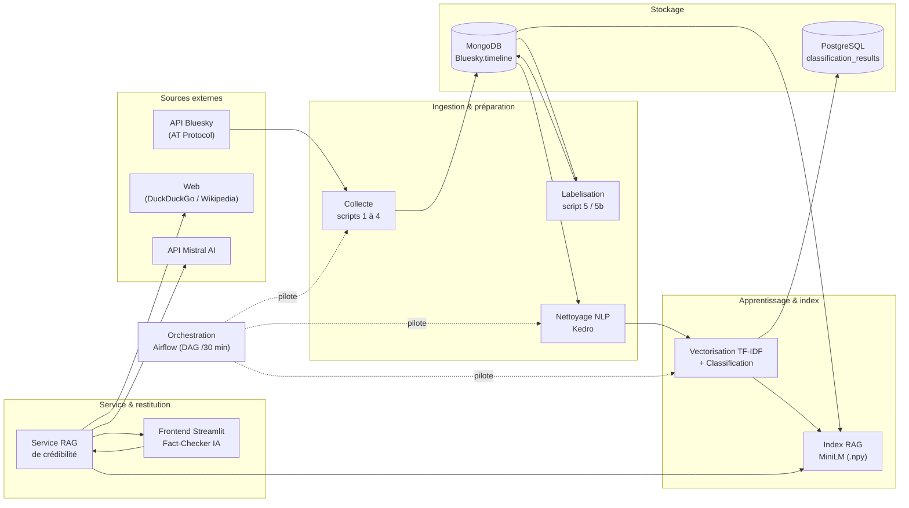
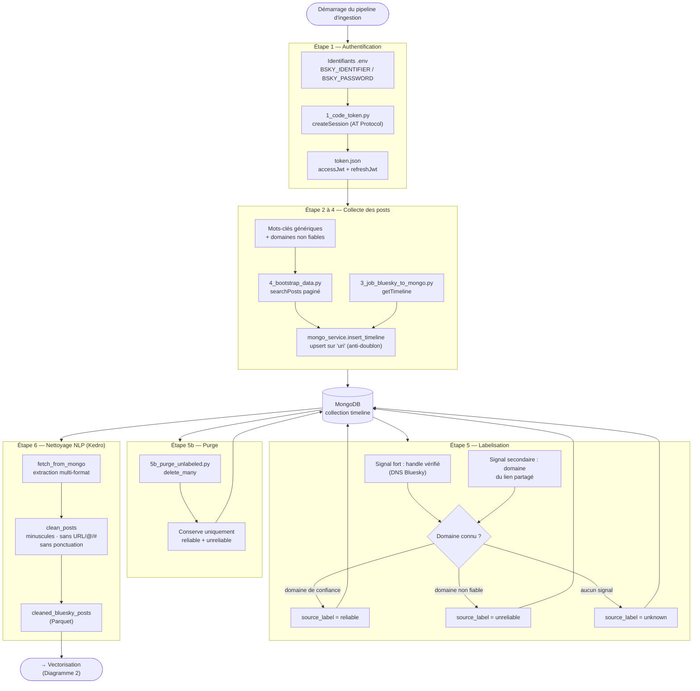

# Diagramme 1 — Architecture globale & chaîne d'ingestion

Ce diagramme couvre l'ensemble de la plateforme à haut niveau, puis détaille la
chaîne d'ingestion : **connexion à l'API Bluesky → bootstrap → labelisation →
purge des non-labellisés → nettoyage NLP**.

---

## 1.1 Vue d'ensemble de la plateforme

---

## 1.2 Chaîne d'ingestion détaillée

De l'authentification jusqu'au texte nettoyé prêt pour la vectorisation.

