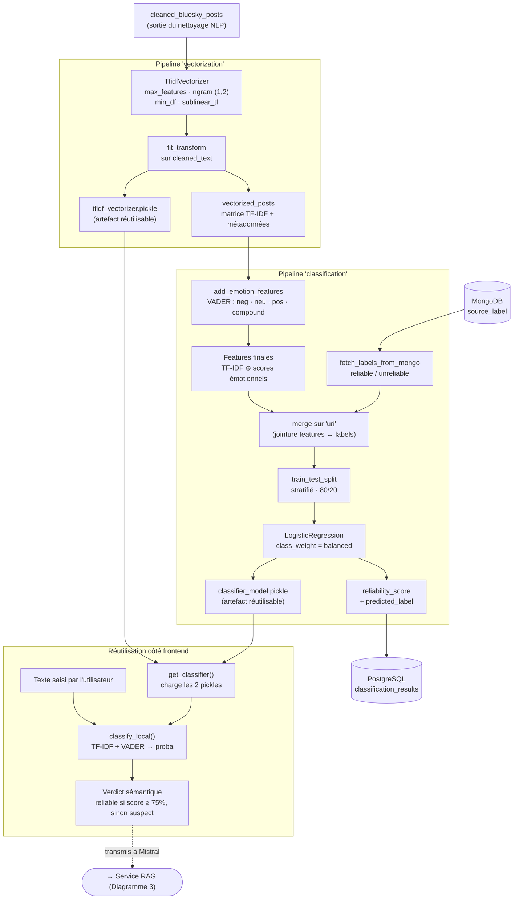

# Diagramme 2 — Vectorisation TF-IDF & Classification

Détaille les deux pipelines Kedro qui transforment le texte nettoyé en vecteurs
numériques, puis entraînent un classifieur de fiabilité. Les artefacts produits
(vectorizer + modèle) sont ensuite réutilisés par le frontend.

## Notes

- **Features hybrides** : la classification ne se fonde pas uniquement sur le
  vocabulaire (TF-IDF) mais ajoute la charge émotionnelle (VADER), car les fausses
  informations présentent souvent un registre plus alarmiste.
- **Double usage du modèle** : entraîné côté pipeline (batch, sauvegarde dans
  PostgreSQL), il est rechargé en temps réel par le frontend pour scorer le texte
  saisi par l'utilisateur — sans nouvel entraînement.
- **Seuil** : le pipeline classe à 0,5 ; le frontend relève le seuil à **0,75**
  pour distinguer « fiable » d'un style simplement « suspect ».
