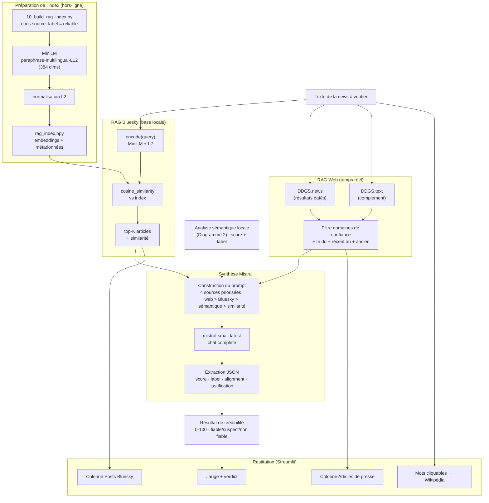

# Diagramme 3 — RAG Web + RAG Bluesky + Mistral

Détaille le cœur du fact-checking : la combinaison de deux sources de contexte
(base Bluesky labellisée via index MiniLM + recherche web temps réel sur sources
fiables) plus l'analyse sémantique locale, le tout synthétisé par Mistral AI pour
produire un score de crédibilité.

## Règles de scoring (appliquées par Mistral)

| Alignement avec les sources | Plage de score | Label |
|---|---|---|
| Confirmée | 70 – 100 | `reliable` (✅ Fiable) |
| Peu couverte / ambiguë | 40 – 69 | `suspect` (⚠️ À vérifier) |
| Contredite | 0 – 39 | `unreliable` (❌ Non fiable) |

**Pondération** : articles web récents > posts Bluesky vérifiés > analyse
sémantique locale > similarité générale. Un style jugé suspect par l'analyse
sémantique (< 75 %) peut faire baisser le score jusqu'à −20 points, surtout
lorsque la couverture factuelle est faible.
